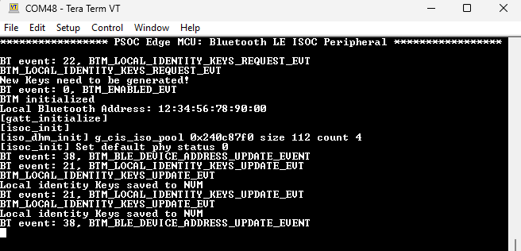
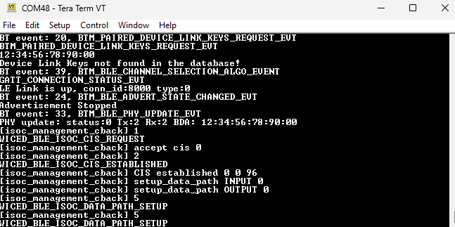
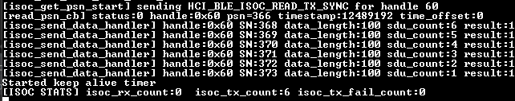
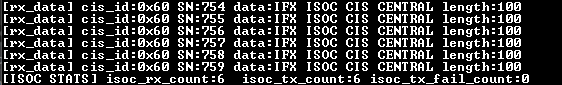
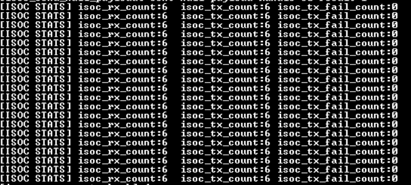

# PSOC&trade; Edge MCU: Bluetooth&reg; LE ISOC Peripheral

This code example showcases the implementation of an Isochronous (ISOC) Peripheral using Bluetooth&reg; Low Energy on the PSOC&trade; Edge E84 MCU with AIROC&trade; CYW55513 Wi-Fi & Bluetooth&reg; combo chip. It sets up a two-way communication data link with a central device through an isochronous channel, allowing for the simultaneous sending and receiving of data.

ISOC is a data transfer mode that guarantees a consistent data transfer rate, making it ideal for applications that require real-time data transmission, such as streaming audio or video, particularly in Bluetooth&reg; Low Energy connections where reliable and efficient data transfer is crucial.

This code example has a three project structure: CM33 secure, CM33 non-secure, and CM55 projects. All three projects are programmed to the external QSPI flash and executed in Execute in Place (XIP) mode. Extended boot launches the CM33 secure project from a fixed location in the external flash, which then configures the protection settings and launches the CM33 non-secure application. Additionally, CM33 non-secure application enables CM55 CPU and launches the CM55 application.

[View this README on GitHub.](https://github.com/Infineon/mtb-example-psoc-edge-btstack-isoc-peripheral)

[Provide feedback on this code example.](https://cypress.co1.qualtrics.com/jfe/form/SV_1NTns53sK2yiljn?Q_EED=eyJVbmlxdWUgRG9jIElkIjoiQ0UyNDA2NDciLCJTcGVjIE51bWJlciI6IjAwMi00MDY0NyIsIkRvYyBUaXRsZSI6IlBTT0MmdHJhZGU7IEVkZ2UgTUNVOiBCbHVldG9vdGgmcmVnOyBMRSBJU09DIFBlcmlwaGVyYWwiLCJyaWQiOiJzdXJlc2hrdW1hcmEiLCJEb2MgdmVyc2lvbiI6IjIuMC4wIiwiRG9jIExhbmd1YWdlIjoiRW5nbGlzaCIsIkRvYyBEaXZpc2lvbiI6Ik1DRCIsIkRvYyBCVSI6IklDVyIsIkRvYyBGYW1pbHkiOiJQU09DIn0=)

See the [Design and implementation](docs/design_and_implementation.md) for the functional description of this code example.

## Requirements

- [ModusToolbox&trade;](https://www.infineon.com/modustoolbox) v3.6 or later (tested with v3.6)
- Board support package (BSP) minimum required version: 1.0.0
- Programming language: C
- Associated parts: All [PSOC&trade; Edge MCU](https://www.infineon.com/products/microcontroller/32-bit-psoc-arm-cortex/32-bit-psoc-edge-arm) parts

## Supported toolchains (make variable 'TOOLCHAIN')

- GNU Arm&reg; Embedded Compiler v14.2.1 (`GCC_ARM`) – Default value of `TOOLCHAIN`
- Arm&reg; Compiler v6.22 (`ARM`)
- IAR C/C++ Compiler v9.50.2 (`IAR`)

## Supported kits (make variable 'TARGET')

- [PSOC&trade; Edge E84 Evaluation Kit](https://www.infineon.com/KIT_PSE84_EVAL) (`KIT_PSE84_EVAL_EPC2`) – Default value of `TARGET`
- [PSOC&trade; Edge E84 Evaluation Kit](https://www.infineon.com/KIT_PSE84_EVAL) (`KIT_PSE84_EVAL_EPC4`)

## Hardware setup

This example uses the board's default configuration. See the kit user guide to ensure that the board is configured correctly.

Ensure the following jumper and pin configuration on board.
- BOOT SW must be in the HIGH/ON position
- J20 and J21 must be in the tristate/not connected (NC) position

To verify the output, two PSOC&trade; Edge E84 Evaluation Kits are required: One for Bluetooth&reg; LE ISOC Central and the other for Bluetooth&reg; LE ISOC Peripheral.

Program the [PSOC&trade; Edge MCU: Bluetooth&reg; LE ISOC Central](https://github.com/Infineon/mtb-example-psoc-edge-btstack-isoc-central) code example on the second kit.

## Software setup

See the [ModusToolbox&trade; tools package installation guide](https://www.infineon.com/ModusToolboxInstallguide) for information about installing and configuring the tools package.

Install a terminal emulator if you do not have one. Instructions in this document use [Tera Term](https://teratermproject.github.io/index-en.html).

This example requires no additional software or tools.

## Operation

See [Using the code example](docs/using_the_code_example.md) for instructions on creating a project, opening it in various supported IDEs, and performing tasks, such as building, programming, and debugging the application within the respective IDEs.

This code example requires you to program the [PSOC&trade; Edge MCU: Bluetooth&reg; LE ISOC Central](https://github.com/Infineon/mtb-example-psoc-edge-btstack-isoc-central) application on another PSOC&trade; Edge E84 Evaluation Kit to communicate.

1. Connect the board to your PC using the provided USB cable through the KitProg3 USB connector

2. Open a terminal program and select the KitProg3 COM port. Set the serial port parameters to 8N1 and 115200 baud

3. After programming, the application starts automatically. Observe the Bluetooth&reg; stack and application trace messages on the UART terminal connected via KitProg3 COM port   

   Ensure to program the [PSOC&trade; Edge MCU: Bluetooth&reg; LE ISOC Central](https://github.com/Infineon/mtb-example-psoc-edge-btstack-isoc-central) application on the other device by following the steps mentioned in its *README.md* file

   **Figure 1. Log message on peripheral device on application start**

   

4. Press the **BTN1** (User Button 1) on the peripheral to start advertising with the name "IFX ISOC". USER LED2 will blink few times on the peripheral device indicating that advertisement has started and stops blinking as the device enters deepsleep mode and logs related to the advertisement is printed as shown in **Figure 2**

   **Figure 2. Log message on peripheral device for advertisement**

   

5. Press the **BTN1** (User Button 1) on the central device to start scanning

6. A Bluetooth&reg; LE connection should be established automatically. Verify that USER LED2 on both boards are glowing

7. After the Bluetooth&reg; LE connections are up, the central will establish an isochronous channel with the peripheral. USER LED1 on both the boards should start glowing

   **Figure 3. Log message on peripheral device after LE and ISOC connection is up**

   

8. Press the **BTN1** (User Button 1) on the peripheral side to send data to the central. When the central receives the data, it toggles the USER LED1 on the central device

    **Figure 4. Log message on peripheral for data transmission**

   

9. Similarly, press the **BTN1** (User Button 1) at the central side to send data to the peripheral. When the peripheral receives the data, it toggles the USER LED1 state of the peripheral device

    **Figure 5. Log message on peripheral device for data reception**

    

10. Isochronous channel statistics are printed every 5 seconds on both the sides as shown in **Figure 6**

     **Figure 6. Log message on peripheral device for ISOC statistics**

     

     Ideally, the isoc_tx_count on the central side should be equal to the isoc_rx_count of the peripheral device and vice versa. Similarly, the packet sequence number (PSN) should also be equal on both the sides. Note that when a Connection-Oriented Isochronous Stream (CIS) connection is lost, you need to reset both the boards to start over 

11. Long press the **BTN1** (User Button 1) on the peripheral device for 3 seconds to reset the kv-store library, which in turn removes the link keys stored in the non-volatile memory (NVM) 

     **Figure 7. Log message on peripheral for pairing key reset**

     

## Resources and settings

This section explains the ModusToolbox&trade; software resources and their configurations as used in this code example. Note that all the configuration explained in this section has already been implemented in the code example.

- **Bluetooth&reg; Configurator:** The Bluetooth&reg; peripheral has a configurator called the “Bluetooth&reg; Configurator” that is used to generate the Bluetooth&reg; LE GATT database and various Bluetooth&reg; settings for the application. These settings are stored in the file named *design.cybt*.

See the [Bluetooth&reg; Configurator guide](https://www.infineon.com/ModusToolboxBLEConfig) for more details.

## Related resources

Resources  | Links
-----------|----------------------------------
Application notes  | [AN235935](https://www.infineon.com/AN235935) – Getting started with PSOC&trade; Edge E8 MCU on ModusToolbox&trade; software   [AN236697](https://www.infineon.com/AN236697) – Getting started with PSOC&trade; MCU and AIROC&trade; Connectivity devices 
Code examples  | [Using ModusToolbox&trade;](https://github.com/Infineon/Code-Examples-for-ModusToolbox-Software) on GitHub
Device documentation | [PSOC&trade; Edge MCU datasheets](https://www.infineon.com/products/microcontroller/32-bit-psoc-arm-cortex/32-bit-psoc-edge-arm#documents)   [PSOC&trade; Edge MCU reference manuals](https://www.infineon.com/products/microcontroller/32-bit-psoc-arm-cortex/32-bit-psoc-edge-arm#documents)
Development kits | Select your kits from the [Evaluation board finder](https://www.infineon.com/cms/en/design-support/finder-selection-tools/product-finder/evaluation-board)
Libraries  | [mtb-dsl-pse8xxgp](https://github.com/Infineon/mtb-dsl-pse8xxgp) – Device support library for PSE8XXGP   [retarget-io](https://github.com/Infineon/retarget-io) – Utility library to retarget STDIO messages to a UART port   [btstack-integration](https://github.com/Infineon/btstack-integration) – The btstack-integration hosts platform adaptation layer (porting layer) between AIROC&trade; BTSTACK and Infineon's different hardware platforms   [kv-store](https://github.com/Infineon/kv-store) – This library provides a convenient way to store information as key-value pairs in non-volatile storage
Tools  | [ModusToolbox&trade;](https://www.infineon.com/modustoolbox) – ModusToolbox&trade; software is a collection of easy-to-use libraries and tools enabling rapid development with Infineon MCUs for applications ranging from wireless and cloud-connected systems, edge AI/ML, embedded sense and control, to wired USB connectivity using PSOC&trade; Industrial/IoT MCUs, AIROC&trade; Wi-Fi and Bluetooth&reg; connectivity devices, XMC&trade; Industrial MCUs, and EZ-USB&trade;/EZ-PD&trade; wired connectivity controllers. ModusToolbox&trade; incorporates a comprehensive set of BSPs, HAL, libraries, configuration tools, and provides support for industry-standard IDEs to fast-track your embedded application development

 

## Other resources

Infineon provides a wealth of data at [www.infineon.com](https://www.infineon.com) to help you select the right device, and quickly and effectively integrate it into your design.

## Document history

Document title: *CE240647* – *PSOC&trade; Edge MCU: Bluetooth&reg; LE ISOC Peripheral*

 Version | Description of change
 ------- | ---------------------
 1.x.0   | New code example   Early access release
 2.0.0   | GitHub release
 

All referenced product or service names and trademarks are the property of their respective owners.

The Bluetooth&reg; word mark and logos are registered trademarks owned by Bluetooth SIG, Inc., and any use of such marks by Infineon is under license.

PSOC&trade;, formerly known as PSoC&trade;, is a trademark of Infineon Technologies. Any references to PSoC&trade; in this document or others shall be deemed to refer to PSOC&trade;.

---------------------------------------------------------

© Cypress Semiconductor Corporation, 2023-2025. This document is the property of Cypress Semiconductor Corporation, an Infineon Technologies company, and its affiliates ("Cypress").  This document, including any software or firmware included or referenced in this document ("Software"), is owned by Cypress under the intellectual property laws and treaties of the United States and other countries worldwide.  Cypress reserves all rights under such laws and treaties and does not, except as specifically stated in this paragraph, grant any license under its patents, copyrights, trademarks, or other intellectual property rights.  If the Software is not accompanied by a license agreement and you do not otherwise have a written agreement with Cypress governing the use of the Software, then Cypress hereby grants you a personal, non-exclusive, nontransferable license (without the right to sublicense) (1) under its copyright rights in the Software (a) for Software provided in source code form, to modify and reproduce the Software solely for use with Cypress hardware products, only internally within your organization, and (b) to distribute the Software in binary code form externally to end users (either directly or indirectly through resellers and distributors), solely for use on Cypress hardware product units, and (2) under those claims of Cypress's patents that are infringed by the Software (as provided by Cypress, unmodified) to make, use, distribute, and import the Software solely for use with Cypress hardware products.  Any other use, reproduction, modification, translation, or compilation of the Software is prohibited.
 
TO THE EXTENT PERMITTED BY APPLICABLE LAW, CYPRESS MAKES NO WARRANTY OF ANY KIND, EXPRESS OR IMPLIED, WITH REGARD TO THIS DOCUMENT OR ANY SOFTWARE OR ACCOMPANYING HARDWARE, INCLUDING, BUT NOT LIMITED TO, THE IMPLIED WARRANTIES OF MERCHANTABILITY AND FITNESS FOR A PARTICULAR PURPOSE.  No computing device can be absolutely secure.  Therefore, despite security measures implemented in Cypress hardware or software products, Cypress shall have no liability arising out of any security breach, such as unauthorized access to or use of a Cypress product. CYPRESS DOES NOT REPRESENT, WARRANT, OR GUARANTEE THAT CYPRESS PRODUCTS, OR SYSTEMS CREATED USING CYPRESS PRODUCTS, WILL BE FREE FROM CORRUPTION, ATTACK, VIRUSES, INTERFERENCE, HACKING, DATA LOSS OR THEFT, OR OTHER SECURITY INTRUSION (collectively, "Security Breach").  Cypress disclaims any liability relating to any Security Breach, and you shall and hereby do release Cypress from any claim, damage, or other liability arising from any Security Breach.  In addition, the products described in these materials may contain design defects or errors known as errata which may cause the product to deviate from published specifications. To the extent permitted by applicable law, Cypress reserves the right to make changes to this document without further notice. Cypress does not assume any liability arising out of the application or use of any product or circuit described in this document. Any information provided in this document, including any sample design information or programming code, is provided only for reference purposes.  It is the responsibility of the user of this document to properly design, program, and test the functionality and safety of any application made of this information and any resulting product.  "High-Risk Device" means any device or system whose failure could cause personal injury, death, or property damage.  Examples of High-Risk Devices are weapons, nuclear installations, surgical implants, and other medical devices.  "Critical Component" means any component of a High-Risk Device whose failure to perform can be reasonably expected to cause, directly or indirectly, the failure of the High-Risk Device, or to affect its safety or effectiveness.  Cypress is not liable, in whole or in part, and you shall and hereby do release Cypress from any claim, damage, or other liability arising from any use of a Cypress product as a Critical Component in a High-Risk Device. You shall indemnify and hold Cypress, including its affiliates, and its directors, officers, employees, agents, distributors, and assigns harmless from and against all claims, costs, damages, and expenses, arising out of any claim, including claims for product liability, personal injury or death, or property damage arising from any use of a Cypress product as a Critical Component in a High-Risk Device. Cypress products are not intended or authorized for use as a Critical Component in any High-Risk Device except to the limited extent that (i) Cypress's published data sheet for the product explicitly states Cypress has qualified the product for use in a specific High-Risk Device, or (ii) Cypress has given you advance written authorization to use the product as a Critical Component in the specific High-Risk Device and you have signed a separate indemnification agreement.
 
Cypress, the Cypress logo, and combinations thereof, ModusToolbox, PSoC, CAPSENSE, EZ-USB, F-RAM, and TRAVEO are trademarks or registered trademarks of Cypress or a subsidiary of Cypress in the United States or in other countries. For a more complete list of Cypress trademarks, visit www.infineon.com. Other names and brands may be claimed as property of their respective owners.
